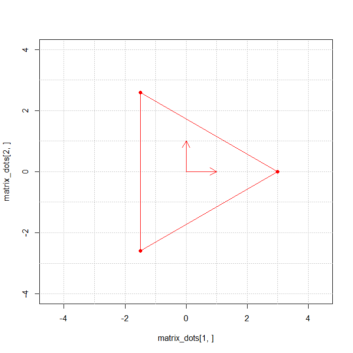

#

```{r, include=FALSE}
# point1 = 3 * c(cos(0), sin(0))
# point2 = 3 * c(cos(2 * pi / 3), sin(2 * pi / 3))
# point3 = 3 * c(c(cos(4 * pi / 3), sin(4 * pi / 3)))
# matrix_dots = cbind(point1, point2, point3)
# 
# 
# angle = seq(0, 2 * pi, length.out = 200)
# 
# for (i in 1:200) {
#     png(paste0(1000 + i, ".png"), width = 700, height = 700, res = 100)
#     phi = angle[i]
#     plot(x = matrix_dots[1, ], y = matrix_dots[2, ], cex = 1, pch = 19, asp = 1,
#      xlim = c(-4, 4), ylim = c(-4, 4))
#     segments(x0 = matrix_dots[1, ], y0 = matrix_dots[2, ], 
#          x1 = matrix_dots[1, c(2, 3, 1)], y1 = matrix_dots[2, c(2, 3, 1)])
#     abline(h = -9:9, v = -9:9, lty = 3, lwd = I(0.4), col = "grey")
#     arrows(x0 = c(0, 0), y0 = c(0, 0), x1 = c(1, 0), y1 = c(0, 1), length = I(0.15))
#     
#     A = cbind(c(cos(phi), sin(phi)),
#           c(-sin(phi), cos(phi)))
# 
#     matrix_dots_A <- A %*% matrix_dots 
#     
#     segments_red = rbind(rep(c(-9:9), 2), c(rep(-9, 19), rep(9, 19)))
#     
#     points(x = matrix_dots_A[1, ], y = matrix_dots_A[2, ], cex = 1, pch = 19, asp = 1,
#            xlim = c(-3, 3), ylim = c(-3, 3), col = "red")
#     segments(x0 = matrix_dots_A[1, ], y0 = matrix_dots_A[2, ], 
#              x1 = matrix_dots_A[1, c(2, 3, 1)], y1 = matrix_dots_A[2, c(2, 3, 1)], col = "red")
#     arrows(x0 = c(0, 0), y0 = c(0, 0), x1 = c(cos(phi), -sin(phi)), y1 = c(sin(phi), cos(phi)),             length = I(0.15), col = "red")
#     dev.off()
# }


```





```{r}
# Матричное экспоненцирование -------------------------------------------------
matrix_exp <- function(matrix, k) { # matrix - матрица любого размера, k - аргумент качества
    xk = diag(rep(1, nrow(matrix))) # диагональная матрица
    y = xk
    t = 0       # Факториал снизу
    for (i in 1:k) {
        t = t + 1   
        xk = xk %*% matrix / t   # Матричное умножение и деление для получения степени
        y = y + xk
    }
    return(y)
}

matrix_exp(pi/4 * matrix(c(0, 1, -1, 0), nrow = 2), 100)
```


```{r}
generator = matrix(c(0, 1, -1, 0), nrow = 2)
A_dot = matrix_exp(pi/4 * generator, 100)
```

