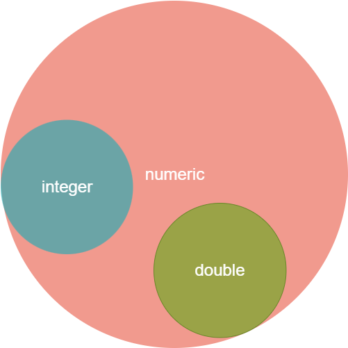

```{r setup, include=FALSE}
knitr::opts_chunk$set(echo = TRUE)
```

------------------------------------------------------------

# Переменные (имена)

## Операция присваивания. Множественное присаивание.

Все переменные в R могут быть объявлены с помощью нескольких возможных способов. Среди них:

- присваивание с помощью "<-" или "=", складывая выражение справа в левое имя;

- присваивание с помощью "->", складывая выражение слева в правое имя;


```{r vars 1, results="hold"}
a <- 5
cat("В а хранится значение:", a, "\n")

7 -> b
cat("В b хранится значение:", b, "\n")

c = 8
cat("В c хранится значение:", c, "\n")
```


Важно обратить внимание на то, что в языке R можно производить множественное цепочное присваивание:

```{r vars 2, results='hold'}
a <- b <- 7.5
8.5 -> d -> c
l = r = 9.5

cat("В a хранится значение:", a, "\n")
cat("В c хранится значение:", c, "\n")
cat("В l хранится значение:", l, "\n")
```

## Разрешенные имена переменных

```{r}

```

-------------------------------------------------------------------------


# Типы данных

## Элементарные типы данных

В языке R все значения элементарных данных, вводимых в среду, с которыми мы производим операции относятся к одному из элементарных типов. Типы данных отвечают за **размер** (в памяти) элементарной единицы данных, а так же за представление внутри среды в виде используемых функций над данными типами.

Среди элементарных типов данных в R выделяют:

- булевые (logical) -- $\{True, False\}$

- числовые (numeric, integer, double) -- целые $x \in \mathbf{Z}$ и числа с плавающей запятой $y \in \mathbf{R}$.

- комплексные (complex) -- числа в виде пары действительных чисел $a,b \in \mathbf{R}:a + ib = (a, b)$, образующих алгебру $(\mathbf{R}\times \mathbf{R}, \{+, -, \cdot, \div\})$ над носителем $\mathbf{R}\times \mathbf{R}$

- символьные (character) -- массив символов, составляющих строку.

- сырые (raw) -- данные, представленные в 16-ти ричной системе счисления. 

Данные типы данных составляют основной перечень элементарных типов данных, из которых в дальнейшем будут составлены все остальные стандартные классы языка и составные классы из пакетов сообщества.

## Логический тип данных

Логический тип данных является типом с двумя возможными значениями TRUE и FALSE. Проверить тип переменной на логический тип данных можно при помощи функции, возвращающей булевое значение **is.logical()**:

```{r vars boolean, results='hold'}
var_T <- TRUE
var_F <- FALSE

print(is.logical(var_T))  # TRUE т.к. логический
print(is.logical(var_F))  # TRUE т.к. логический
print(is.logical(5))      # FALSE т.к. числовой
```

Над данным типом установлены логические операции $ \{!, \&, |, xor(a, b)\} $, которые определены булевой алгеброй.

```{r bool op, results='hold'}
var_T <- TRUE
var_F <- FALSE

print(!var_T)               # Логическое отрицание
print(var_T & var_F)        # Конъюнкция
print(var_T | var_F)        # Дизъюнкция
print(xor(var_T, var_F))    # Сложение по модулю два 
```

Данный тип можно привести к числовому любой арифметической операцией. В данном случае TRUE будет расценено как 1, а FALSE будет расценено как 0.

```{r bool to numeric, results='hold'}
print(var_T * 4)  # 1 * 4
print(var_F + 3)  # 0 + 3
```

Логический тип является наиболее важным в уловиях ветвления программного кода, флагах программы, обработки исключений, циклов и прочих нелинейных частях программы. Важно знать все преобразования и действия над данным типом для возможности корректного описания кода.

## Числовой тип данных

Числовой тип данных в R является смешанным типом, который объединяет в себе целые числа (integer) и числа с плавающей точкой (double), и называется в языке типом numeric.

Проверить, является ли переменная числовой с типом numeric можно с помощью функции **is.numeric()**. Если переменная явно объявлена целочисленной, то проверить на целое или дробное можно с помощью функций **as.integer()** или **as.double()** соответственно:

```{r num vars, results='hold'}
var_numeric <- 5
var_integer <- 5L
var_double <- 5.0

print(is.numeric(var_numeric))
print(is.integer(var_integer))
print(is.double(var_double))
```

Проверим с помощью встроенных функций как соотносятся множества чисел, существующих в R:

```{r check floating, results='hold'}
# Вернет FALSE т.к. integer явно отличается от double
print(is.double(var_integer))     
# Вернет FALSE т.к. double явно отличается от integer
print(is.integer(var_double))
print(is.numeric(var_integer))
print(is.numeric(var_double))
```

Полученная картина может быть изображена на диграмме Венна как:



Операции над числовыми переменными являются классическими для языков програмирования $\{+, -,*,\backslash, **, \dots\}$ и возможности применения операций над числами были показаны ранее выше, использование числовых переменных в таких выражениях не изменилось. 

```{r arifm numeric,results='hold'}
var_1 <- 56
var_2 <- -56

print(var_1 + var_2)
print(var_1 - var_2)
print(var_1 * var_2)
print(var_1 / var_2)
print(var_1 ^ var_2)
```

Все остальные возможности будут завязаны на другом свойстве переменных в R, которые будут показаны далее по ходу курса.


## Комплексный тип данных

В языке R по умолчанию определены комплексные числа, необходимые для научных математических расчётов. Такие числа можно определить с помощью классической математической записи $\{a + bi\ |\  a,b \in \mathbf{R}\}$:

```{r complex vars, results='hold'}
var_complex <- 5 + 7i
print(var_complex)
print(is.complex(var_complex))
```

Для данного типа значений в языке существуют специальные операторы и перегружены арифметические операторы по правилам комплексной арифметики:

1. сложение $\{+\}$,
2. вычитание $\{-\}$,
3. умножение $\{*\}$,
4. деление $\{\backslash\}$,
5. возведение в степень $\{**\}$,
6. экспонента, тригонометрия $\{exp(), sin(), cos(), \dots\}$,
7. сопряженное **Conj()**,
8. аргумент **Arg()**,
9. модуль **Mod()**,
10. действительая часть числа **Re()**, 
11. мнимая часть числа **Im()**,

```{r complex arifm, results='hold'}
var_c_1 <- 5 + 8i
var_c_2 <- -3 - 5i
cat("z1:", var_c_1)
cat("\nz2:", var_c_2)
cat("\nСложение z1 + z2:", var_c_1 + var_c_2)    # Сложение
cat("\nВычитание z1 + z2:", var_c_1 - var_c_2)    # Вычитание
cat("\nУмножение z1 * z2:", var_c_1 * var_c_2)    # Умножение
cat("\nДеление z1 / z2:", var_c_1 / var_c_2)    # Деление
cat("\nВозведение в степень z1^z2:", var_c_1 ^ var_c_2)   # Возведение в степень
cat("\nЭкспонента z1:", exp(var_c_1)) # Экспонента
cat("\nСопряженное z1:", Conj(var_c_1))
cat("\nМодуль z1:", Mod(var_c_1))
cat("\nУгол радиус-вектора (аргумент) z1:", Arg(var_c_1))
cat("\nДействительная часть z1:", Re(var_c_1))
cat("\nМнимая часть z1:", Im(var_c_1))
```

Комплексный тип может быть объявлен из числового при помощи явного приведения типа к типу complex с помощью функции **as.complex()** или неявного прибавлением комплексного нуля:

```{r as complex, results='hold'}
a <- 5
c <- as.complex(5)
l <- 5 + 0i
print(a)
print(c)
print(l)
```


## Строковый тип данных

Строковый тип (массив символов) объявляется несколькими способами с помощью заключения информации между двумя двойными кавычками **\" ... \"** или одинарными **\' ... \'**:

```{r char, results='hold'}
var_char1 <- "var_char1"
var_char2 <- 'var_char2'

print(var_char1)
print(var_char2)
```

Возможность выбирать способ объявления дана для использования в новой строке этих самых одинарных или двойных кавычек:

```{r char snip, results='hold'}
var_char3 <- "var'char3'"
var_char4 <- 'var"char4"'

cat(var_char3, "\n")
cat(var_char4)
```
Пример выше показывает, что внешние кавычки определяют объявление, когда внутренние участвуют в самой строке.

Массивы символов в R являются неименяемыми, целостными и с ними нельзя проводить арифметические операции. Строки используются в различных методах, как данные, которые указывают на явные названия чего-то, так же строки используются в языке при решении задач анализа текстовой информации. Для строк в языке присутствует множество функций, позволяющих обрабатывать и преобразовывать как отдельные части строки так и строки в целом и в их явной комбинации.


-------------------------------------------------------------------------

# Элементарный класс переменной

По умолчанию в языке R все переменные являются объектами класса **вектор** длины один с элементом такого типа данных, который был присвоен имени. Таким образом, вектор является элементарным классом языка R, на логике работы которого завязана вся магическая арифметика языка.

Можно проверить что любая переменная, в которой хранится единственное значение, является вектором:

```{r vars as vec, results='hold'}
var_1 <- 5
var_2 <- 7.5
var_3 <- "hello"
var_4 <- TRUE

print(is.vector(var_1))
print(is.vector(var_2))
print(is.vector(var_3))
print(is.vector(var_4))
```


----------------------------------------------------------------------

# Векторы 


----------------------------------------------------------------------

## Автоматическое приведение типов

Автоматическое приведение типов в случае с переменными в R происходит в результате определенных операций, использующих один тип данных при использовании или при объявлении объекта стандартного класса, использующего только один тип данных в коллекции значений.

Так или иначе, приведение типов в языке R происходит по следующему правилу:

$$
raw \rightarrow logical \rightarrow numeric \rightarrow complex \rightarrow character
$$

В данной последовательности описан последовательный переход между типами данных. Однако существует два возможных сценария применения этого правила:

1. приведение типов работает последовательно с использованием соседних типов данных, т.е. при использовании в одном месте числовых и комплексных данных порождает приведение типа к комплексному типу;

2. приведение типов работает по-особенному при использовании в коллекции символьных массивов.

**Пример**. Объявляется новый объект класса **вектор** (познакомимся с ним позднее), которых хранит коллекцию значений одного типа данных.

```{r types flow, results='hide'}
vector_1 <- c(TRUE, 1, 1.5, 9 + 7i)
vector_2 <- c(TRUE, 1, 1.5, 9 + 7i, "string")

cat("Иллюстрация правила №1:")
print(vector_1)
cat("\nИллюстрация правила №2:")
print(vector_2)
```

Результатом присваивания в первом случае, когда в объявлении вектора участвовали все типы данных кроме строк, является приведение всех типов к комплексному типу через все возможные преобразвания. Иллюстрацией этого является логическое значение TRUE ставшее $1.0 + 0i$.

Результатом присваивания во втором случае, когда в объявлении вектора участвовала строка, является приведение всех типов к строковому, минуя все остальные шаги приведения типов. Значение TRUE стало "TRUE".

----------------------------------------------------------------------

# Вопросы и упражнения